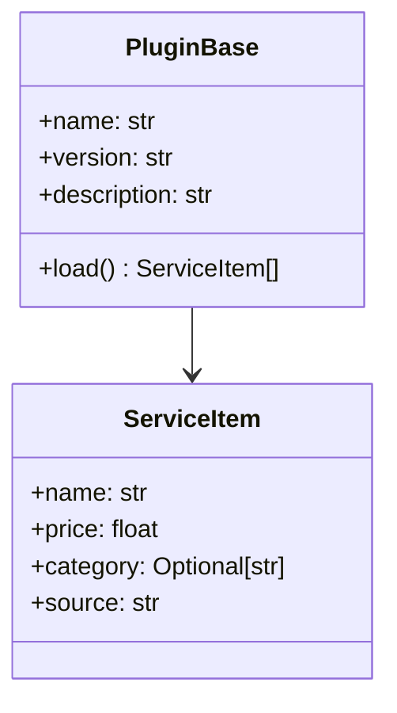

# Архитектура

## Общая схема

```mermaid
graph TD
  UI[PyQt UI] -->|команды| AGG[Aggregator]
  UI -->|загрузка| LOADER[Plugin Loader]
  LOADER -->|модули| PLUGINS[Plugins]
  AGG -->|данные| UI
  PLUGINS -->|ServiceItem[]| AGG
```

## Модель плагина


